# 🗄️ ERD & 테이블 설계서

원본: [`src/main/resources/db/schema.sql`](../src/main/resources/db/schema.sql) (2026-08-22 통합본) + `migration_v16_*` ~ `migration_v21_*`.
DB: MySQL 8, `utf8mb4 / utf8mb4_unicode_ci`, 엔진 InnoDB.
스키마 운영: `schema.sql` 단일 원본 + 번호 마이그레이션. JPA `ddl-auto: update`는 보조.
> v21에서 결제·예약 3테이블(`reservations`, `reservation_payments`, `trip_schedule_payments`)과 `trip_schedules.reservation_id`를 **제거 완료**. 아래 목록·ERD는 제거 후 기준.

## 1. 테이블 전체 목록

| # | 테이블 | 도메인 | 비고 |
|---|---|---|---|
| 1 | `users` | 회원 | 거의 모든 테이블의 참조 중심 |
| 2 | `phone_verifications` | 인증 | 휴대폰 SMS 인증(알리고) |
| 3 | `titles` / `user_titles` | 마이페이지 | 칭호 카탈로그 / 보유 칭호. v17에서 38종 개편 |
| 4 | `tours` | 상품 | 항공+숙박+교통 패키지(더미 고정가) |
| 5 | `activities` | 상품 | 계획표에 넣는 개별 액티비티. v16: `venue_type` NULL 허용 + 장소검색 캐싱 컬럼 |
| 6 | `parties` | 파티 | 번개모임 |
| 7 | `party_members` | 파티 | 승인된 파티원 = 전용 페이지 접근권 |
| 8 | `party_applications` | 파티 | 참가 신청(방장 승인) |
| 9 | `trip_schedules` | 플래너 | 파티당 1개. v16: `locked_by_user_id`, `last_saved_at`. v21: `reservation_id` 제거 |
| 10 | `trip_schedule_items` | 플래너 | 일정 블록(분 단위). v16: `is_fixed` |
| 11 | `trip_schedule_votes` | 플래너 | 계획표 찬반 투표 |
| 12 | `posts` / `post_likes` / `post_comments` | 커뮤니티 | 여행 게시판 |
| 13 | `follows` | 커뮤니티 | 팔로우 |
| 14 | `chat_rooms` / `chat_room_members` / `chat_messages` | 커뮤니티 | 파티 채팅 + DM 공용 |
| 15 | `notifications` | 알림 | 인앱 알림 |
| 16 | `reports` | 신고 | post/party/user 다형 신고 |
| 17 | `trip_schedule_snapshots` | 플래너 | v16 신규. 저장 시점 JSON 스냅샷(롤백 소스) |
| 18 | `manner_temp_logs` | 마이페이지 | v16 신규. 매너온도 가감 이력 |
| 19 | `ai_credit_usage` | AI | v16 신규. 사용자별 일일 AI 크레딧 |
| 20 | `user_profile_theme` | 마이페이지 | v16 신규. 프로필 배경 테마 |

> **v21 제거**: `reservations`, `reservation_payments`, `trip_schedule_payments` (구 9·10·13번).

### JPA 매핑만 있고 `schema.sql`엔 별도 정의된 테이블

엔티티(`@Table`)는 있으나 `schema.sql` 본문에 없는 것 — 후속 마이그레이션/`ddl-auto`로 생성:
`banners`, `support` / `support_comment`, `recommendation`, `tour_reviews`, `file_meta`

### ✅ 결제/예약 제거 완료 (`migration_v21_remove_reservation_payment.sql`)

v16에서 삭제 확정된 결제·예약 기능을 `feature/remove-reservation-payment`에서 제거 완료:
1. Java 코드 삭제 — `ReservationService`, `Reservation*Entity`, `TripSchedulePaymentEntity`, `TripReminderScheduler`, `MyReservationView`, `ReserveTourRequest`, 관련 Repository 3개, `TripScheduleEntity.reservation` 필드
2. `schema.sql` — `reservations`·`reservation_payments`·`trip_schedule_payments` 테이블 및 `trip_schedules.reservation_id`(FK/KEY/COLUMN) 삭제, 섹션 번호 재정렬
3. 기존 DB는 `migration_v21_remove_reservation_payment.sql` 한 번 실행(신규 DB는 갱신된 `schema.sql`이라 불필요)

파생: `ErrorCode`에서 `RESERVATION_NOT_FOUND`/`PAYMENT_NOT_FOUND`/`INSUFFICIENT_POINTS`/`WEATHER_ACK_REQUIRED` 제거. `TripPlannerService.submitForPayment()` → `finalizeSchedule()`(동작 동일: 제출→확정, 결제 없음).

## 2. ERD

```mermaid
erDiagram
    users ||--o{ user_titles : "보유"
    titles ||--o{ user_titles : "카탈로그"
    users ||--o{ phone_verifications : "phone 매칭"

    users ||--o{ parties : "owner_user_id"
    tours  ||--o{ parties : "tour_id (nullable)"
    parties ||--o{ party_members : "구성원"
    users   ||--o{ party_members : "소속"
    parties ||--o{ party_applications : "신청"
    users   ||--o{ party_applications : "applicant"

    parties ||--o| trip_schedules : "party_id (1:1)"
    users   ||--o{ trip_schedules : "locked_by_user_id"
    trip_schedules ||--o{ trip_schedule_items : "일정 블록"
    activities     ||--o{ trip_schedule_items : "activity_id (source=activity)"
    users          ||--o{ trip_schedule_items : "added_by"
    trip_schedules ||--o{ trip_schedule_votes : "찬반"
    users          ||--o{ trip_schedule_votes : "투표자"
    trip_schedules ||--o{ trip_schedule_snapshots : "저장 시점"
    users          ||--o{ trip_schedule_snapshots : "created_by"

    users ||--o{ posts : "작성"
    parties ||--o{ posts : "party_id (nullable)"
    posts ||--o{ post_likes : ""
    posts ||--o{ post_comments : ""
    users ||--o{ post_likes : ""
    users ||--o{ post_comments : ""

    users ||--o{ follows : "follower/followee"

    parties ||--o| chat_rooms : "type=party"
    chat_rooms ||--o{ chat_room_members : ""
    chat_rooms ||--o{ chat_messages : ""
    users ||--o{ chat_room_members : ""
    users ||--o{ chat_messages : "sender"

    users ||--o{ notifications : "수신"
    users ||--o{ reports : "reporter / actioned_by"
    users ||--o{ manner_temp_logs : "대상"
    users ||--o{ ai_credit_usage : "일일 사용량"
    users ||--o| user_profile_theme : "1:1"
```

## 3. 관계 요약

| 부모 | 자식 | 관계 | FK / 제약 |
|---|---|---|---|
| `users` | 대부분 테이블 | 1:N | 각 테이블의 `*_user_id`, `user_id` 등 |
| `parties` | `party_members` | 1:N | `uk_party_user(party_id, user_id)` 유니크 |
| `parties` | `party_applications` | 1:N | `uk_party_applicant(party_id, applicant_id)` |
| `parties` | `trip_schedules` | **1:1** | `uk_schedule_party(party_id)` |
| `parties` | `chat_rooms` | 1:1(type=party) | `chat_rooms.party_id` |
| `trip_schedules` | `trip_schedule_items` | 1:N | `fk_tsi_schedule` |
| `trip_schedules` | `trip_schedule_snapshots` | 1:N | `idx_snapshot_schedule` |
| `trip_schedules` | `trip_schedule_votes` | 1:N | `uk_vote_schedule_user` |
| `activities` | `trip_schedule_items` | 0..1:N | `source=activity`일 때만 `activity_id` |
| `titles` | `user_titles` | 1:N | `uk_user_title(user_id, title_id)` |
| `posts` | `post_likes` / `post_comments` | 1:N | `uk_like_post_user` |
| `chat_rooms` | `chat_room_members` / `chat_messages` | 1:N | `uk_room_user`, `idx_room_created` |

**다형(polymorphic) 참조 — FK 없음**
- `reports.target_type` + `target_id` → `post` / `party` / `user`. 신고 시점 라벨을 `target_label`에 스냅샷.
- `manner_temp_logs.related_id` → `party_id` 또는 `report_id` (reason으로 구분).

## 4. 테이블 상세

> 타입·기본값은 `schema.sql` 기준. `created_at`/`updated_at`은 대부분 `DATETIME DEFAULT CURRENT_TIMESTAMP [ON UPDATE ...]`.

### 4.1 `users` — 회원

| 컬럼 | 타입 | 제약 | 설명 |
|---|---|---|---|
| `id` | BIGINT | PK, AI | |
| `email` | VARCHAR(255) | NOT NULL, `uk_users_email` | 로그인 ID |
| `password` | VARCHAR(255) | NOT NULL | BCrypt 해시. 소셜 전용은 랜덤 해시 |
| `name` | VARCHAR(50) | NOT NULL | |
| `phone` | VARCHAR(20) | NOT NULL, `uk_users_phone` | |
| `phone_verified` | BOOLEAN | DEFAULT FALSE | |
| `gender` | ENUM(`male`,`female`) | NOT NULL | 파티 성별 제한 매칭 |
| `birth_date` | DATE | NOT NULL | 성인 인증 + 연령 제한 |
| `nationality` | ENUM(`KR`,`JP`) | NOT NULL | 국적 제한 필터 |
| `preferred_lang` | ENUM(`ko`,`ja`) | DEFAULT `ko` | 기본 언어 |
| `manner_temp` | DECIMAL(4,1) | DEFAULT 36.5 | 매너온도 |
| `points_krw` / `points_jpy` | INT | DEFAULT 0 | 포인트(결제 제거로 활용도 낮음) |
| `role` | ENUM(`user`,`admin`) | DEFAULT `user` | |
| `status` | ENUM(`active`,`suspended`) | DEFAULT `active` | 관리자 정지 |
| `profile_image_url` | VARCHAR(500) | NULL | |
| `intro` | VARCHAR(300) | NULL | 자기소개 |
| `social_provider` / `social_id` | VARCHAR | NULL, `uk_users_social(provider,id)` | google / naver (로컬 가입 NULL) |

### 4.2 `phone_verifications` — 휴대폰 인증

| 컬럼 | 타입 | 설명 |
|---|---|---|
| `phone` | VARCHAR(20) | 대상 번호 |
| `code_hash` | VARCHAR(255) | 인증코드 해시 |
| `purpose` | ENUM(`signup`,`find_password`,`change_phone`) | 용도 |
| `expires_at` | DATETIME | 만료(발송+300초) |
| `attempt_count` | INT | 시도 횟수(최대 5) |
| `verified_at` / `used_at` | DATETIME NULL | 인증 완료 / 소비 시각 |
| 인덱스 | `idx_pv_phone_purpose(phone, purpose, created_at)` | |

### 4.3 `titles` / `user_titles` — 칭호

`titles`: `code`(유니크, 접두사가 카테고리), `name`, `category`(표시용, **NULL 허용** — 코드에서 널 처리 주의), `condition_desc`, `icon_key`(이모지).
`user_titles`: `user_id` + `title_id` (`uk_user_title` 유니크), `earned_at`. FK 양쪽.
v17: 카탈로그를 8카테고리(여행횟수 T / 국내지역 R / 광역시 M / 일본권역 J / 매너온도 MAN / 파티활동 P / 여행거리 D / 액티비티 A) 총 38종으로 개편.

### 4.4 `tours` — 패키지 상품 (더미 고정가)

주요 컬럼: `title`, `region`(일본 지역, 지도 키와 동일 문자열), `price_krw`/`price_jpy`, `duration_nights`, `dep_time`/`arr_time`/`checkin_time`/`checkout_time`, `venue_type`(indoor/outdoor/mixed), `style_tag`(콤마 구분), `min_participants`/`max_participants`, `latitude`/`longitude`(DECIMAL(10,7), 지도·날씨), `external_flight_url`/`external_hotel_url`, `status`(active/hidden).
제약: `ck_tours_price CHECK (price_krw > 0 AND price_jpy > 0)`.

### 4.5 `activities` — 개별 액티비티

| 컬럼 | 타입 | 설명 |
|---|---|---|
| `title` / `region` | VARCHAR | `region`은 `tours.region`과 동일 값 |
| `venue_type` | ENUM(`indoor`,`outdoor`,`mixed`) NULL | **v16: 판정 전 NULL** — AI가 첫 조회 시 채움 |
| `style_tag` | VARCHAR(100) | 축제/먹거리/명소/이동/휴식 (필터 + 색 범례) |
| `duration_min` | INT | DEFAULT 60. 드래그 초기 칸 크기 |
| `price_krw` / `price_jpy` | INT | DEFAULT 0 |
| `latitude` / `longitude` | DECIMAL(10,7) | 날씨 API 조회용 |
| `external_place_id` | VARCHAR(200) | `uk_activities_place` — 장소검색 API 중복 저장 방지 |
| `place_provider` | ENUM(`google`,`osm`) NULL | v16, 제공사 미확정 |
| `cached_at` | DATETIME NULL | v16, venue_type 캐싱 갱신 시각 |

### 4.6 `parties` — 번개모임

| 컬럼 | 타입 | 설명 |
|---|---|---|
| `owner_user_id` | BIGINT | FK `users`. 파티장 |
| `tour_id` | BIGINT NULL | FK `tours`. 미정이면 NULL |
| `title` / `description` / `region` | | |
| `departure_date` | DATE | 출발일 |
| `duration_days` | TINYINT | DEFAULT 1. `departure_date + duration_days` = 종료일(스케줄러 판단 기준) |
| `budget_krw` | INT NULL | 1인 예산(표시용) |
| `capacity` | TINYINT | 정원 |
| `style_tag` | VARCHAR(100) | 메인 태그 필터 |
| `gender_restriction` | ENUM(`all`,`male_only`,`female_only`) | |
| `age_min` / `age_max` | TINYINT NULL | |
| `nationality_restriction` | ENUM(`all`,`kr_only`,`jp_only`) | |
| `status` | ENUM(`recruiting`,`full`,`closed`,`completed`) | `completed`는 스케줄러 자동 전환 |

### 4.7 `party_members` / 4.8 `party_applications`

- `party_members`: `role` ENUM(`owner`,`member`), `joined_at`. `uk_party_user(party_id,user_id)`.
- `party_applications`: `message`(신청 사유), `status` ENUM(`pending`,`approved`,`rejected`), `applied_at`/`reviewed_at`. `uk_party_applicant(party_id,applicant_id)`.

### 4.9 `trip_schedules` — 계획표

| 컬럼 | 타입 | 설명 |
|---|---|---|
| `party_id` | BIGINT NULL | FK. `uk_schedule_party` (파티당 1개) |
| `status` | ENUM(`draft`,`submitted`,`confirmed`) | `finalizeSchedule()`로 제출→확정, 이후 자유편집 잠금 |
| `locked_by_user_id` | BIGINT NULL | **v16**. 현재 편집권 보유자. NULL=전원 읽기전용 |
| `last_saved_at` | DATETIME NULL | **v16**. 마지막 저장(자동/수동) 시각 |
| `submitted_at` / `confirmed_at` | DATETIME NULL | |

### 4.10 `trip_schedule_items` — 일정 블록

| 컬럼 | 타입 | 설명 |
|---|---|---|
| `schedule_id` | BIGINT | FK `trip_schedules` |
| `day_index` | TINYINT | N일차 |
| `start_minute` | SMALLINT | 0~1439 (`ck_tsi_start`) |
| `duration_minute` | SMALLINT | ≥1 (`ck_tsi_duration`). 1분 단위 조절 |
| `source` | ENUM(`package_default`,`activity`,`custom`) | 출처 |
| `is_fixed` | BOOLEAN | **v16**. true=고정(LOCK, 동선 최적화 제외) |
| `activity_id` | BIGINT NULL | `source=activity`일 때만. FK `activities` |
| `title` / `memo` | VARCHAR | |
| `price_krw` / `price_jpy` | INT | 추가 시점 가격 **스냅샷**(activities 실시간 참조 안 함) |
| `added_by` | BIGINT | FK `users` |

### 4.11 `trip_schedule_votes`

`schedule_id` + `user_id` (`uk_vote_schedule_user`), `vote` ENUM(`agree`,`disagree`), `voted_at`.

### 4.17 `trip_schedule_snapshots` — 저장 시점 스냅샷 (v16 신규)

| 컬럼 | 타입 | 설명 |
|---|---|---|
| `schedule_id` | BIGINT | FK |
| `snapshot_data` | JSON | 저장 시점 전체 `trip_schedule_items` 스냅샷 |
| `trigger_type` | ENUM(`auto`,`manual`) | 자동(주기)/수동. *(코드에서 `ai_valid` 추가 예정 — feature/planner)* |
| `created_by` | BIGINT | FK `users` |
| 인덱스 | `idx_snapshot_schedule(schedule_id, created_at)` | |

### 4.12 `posts` / `post_likes` / `post_comments`

- `posts`: `user_id`, `party_id`(NULL 가능), `title`, `content` TEXT, `region`, `thumbnail_url`, `like_count`(비정규화 카운트).
- `post_likes`: `uk_like_post_user(post_id,user_id)`.
- `post_comments`: `content` VARCHAR(300).

### 4.13 `follows`

`follower_id`, `followee_id`. `uk_follow_pair` 유니크, `ck_follow_not_self CHECK (follower_id <> followee_id)`.

### 4.14 `chat_rooms` / `chat_room_members` / `chat_messages`

- `chat_rooms`: `type` ENUM(`party`,`dm`), `party_id`(type=party일 때만).
- `chat_room_members`: `uk_room_user(room_id,user_id)`.
- `chat_messages`: `content` VARCHAR(1000), `original_lang` ENUM(`ko`,`ja`)(번역 버튼 source lang), `idx_room_created(room_id, created_at)`.

### 4.15 `notifications`

`user_id`, `type` VARCHAR(30)(`party_approved`, `new_follower`, `new_comment` 등. `trip_reminder`는 v21에서 발행 주체 삭제됨), `title`, `message`, `link_url`, `is_read`. `idx_notif_user(user_id, is_read, created_at)`.

### 4.16 `reports`

| 컬럼 | 타입 | 설명 |
|---|---|---|
| `reporter_id` | BIGINT | FK `users` |
| `target_type` | ENUM(`post`,`party`,`user`) | 다형 대상 |
| `target_id` | BIGINT | **FK 없음** (여러 테이블 가리킴) |
| `target_label` | VARCHAR(200) | 신고 시점 제목/이름 스냅샷 |
| `reason` | VARCHAR(500) | |
| `status` | ENUM(`pending`,`resolved`,`dismissed`) | |
| `action_taken` | ENUM(`none`,`hidden`,`deleted`) | **v16**. 콘텐츠 최종 조치 |
| `actioned_by` | BIGINT NULL | **v16**. 조치한 관리자. FK `users` |
| 인덱스 | `idx_report_status(status, created_at)` | |

### 4.18 `manner_temp_logs` — 매너온도 이력 (v16 신규)

`user_id`, `delta` DECIMAL(3,1)(예 +0.5 / -1.0), `reason` ENUM(`party_complete`,`host_bonus`,`report_penalty`,`leave_penalty`), `related_id`(party_id 또는 report_id, FK 없음). `idx_mtl_user(user_id, created_at)`.

### 4.19 `ai_credit_usage` — 일일 AI 크레딧 (v16 신규)

`user_id` + `usage_date` DATE (`uk_acu_user_date` 유니크), `used_count`, `daily_limit`(전원 동일). 자정 초기화는 날짜 키로 자연 처리.

### 4.20 `user_profile_theme` — 프로필 배경 (v16 신규)

`user_id` (`uk_upt_user` 유니크 = 1:1), `theme_key` VARCHAR(50)(사전 정의 스킨 키), `updated_at`.

## 5. 인덱스 / 제약 요약

| 종류 | 목록 |
|---|---|
| 유니크 | `users`(email, phone, social), `user_titles`, `titles.code`, `activities.external_place_id`, `party_members`, `party_applications`, `trip_schedules`(party), `trip_schedule_votes`, `post_likes`, `follows`, `chat_room_members`, `ai_credit_usage`, `user_profile_theme` |
| CHECK | `tours`(가격>0), `trip_schedule_items`(start 0~1439, duration≥1), `follows`(자기 팔로우 금지) |
| 조회 인덱스 | `phone_verifications`, `chat_messages`(room+created), `notifications`(user+read+created), `reports`(status+created), `trip_schedule_snapshots`(schedule+created), `manner_temp_logs`(user+created) |
| 비정규화 | `posts.like_count` (좋아요 수 캐시) |

## 6. 시드 / 마이그레이션 파일

| 파일 | 내용 |
|---|---|
| `schema.sql` | 전체 스키마(통합본) |
| `data.sql` | 데모 데이터. **모든 계정 비밀번호 `Test1234!`** (BCrypt). 관리자 1 + 한국인 4 + 일본인 3 |
| `demo_heatmap_data.sql` | 히트맵 데모용 여행/파티 데이터 |
| `migration_v16_planner_manner_ai.sql` | 플래너 편집권/자동저장/롤백, 매너온도 이력, AI 크레딧, 장소검색 캐싱, 프로필 꾸미기, 파티 완료 처리 |
| `migration_v16_mypage_titles.sql` | 칭호 조건을 예약 기준 → 완료 파티 기준으로 교체 |
| `migration_v17_titles_catalog.sql` | 칭호 38종 / 8카테고리 개편 |
| `migration_v21_remove_reservation_payment.sql` | ✅ 결제·예약 3테이블 + `trip_schedules.reservation_id` 제거. 기존 DB만 실행(신규 DB는 갱신된 `schema.sql`) |
